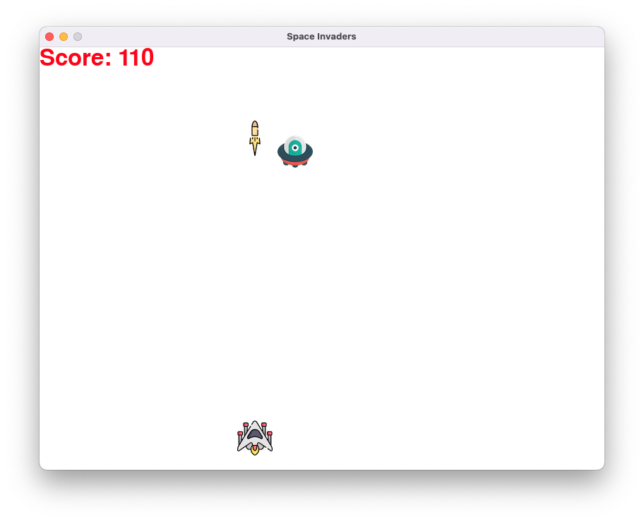

# Space Invaders game with PyGame

## 
### Description
This is a simple version of the space invaders arcade game using [PyGame](https://pypi.org/project/pygame/).
All icons are copy right to [flaticon.com](href="https://www.flaticon.com/free-icons/).

### Project motivation
I completed this portfolio website, as one of the assignments in professional [Python 100 Days bootcamp](https://www.udemy.com/course/100-days-of-code/) by [Dr. Angela Yu](https://github.com/angelabauer).

### Quick Start
- Install the requirements in requirements.txt
- Run the game in Python

[//]: # (- Dynamic version at [Render hosted]&#40;https://portfolio-website-d1x4.onrender.com&#41;)
